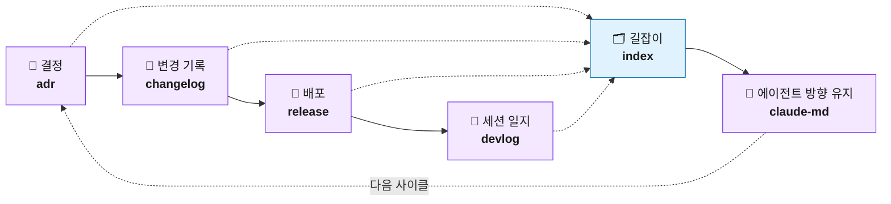
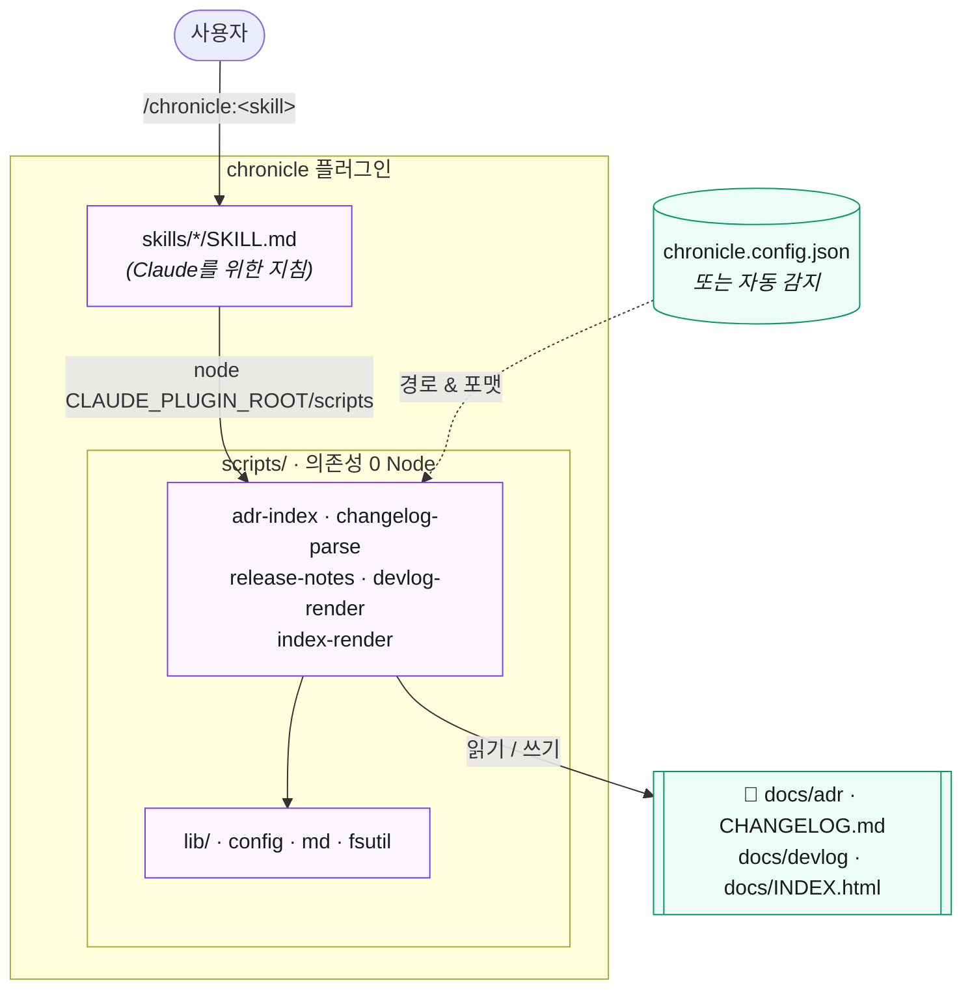

# 📜 chronicle

[English](README.md) · **한국어**

> 프로젝트의 **문서화 lifecycle**(결정·변경·배포·일지·길잡이)을 6개의 집중된 skill로 자동화하는 Claude Code 플러그인.

[](LICENSE)
[](https://code.claude.com/docs/en/plugins)
[](https://nodejs.org)
[](#어떻게-만들어졌나)

chronicle은 자꾸 미루게 되는 문서화 잡일 — ADR 작성, changelog 갱신, 릴리즈 cut, devlog 작성, 프로젝트 index와 `CLAUDE.md` 유지보수 — 을 한 줄 명령으로 바꿔줍니다. 모든 워크플로는 작은 (선택적) 설정 파일과 자동 감지로 *당신의* 프로젝트 구조에 맞춰지고, 결정론적인 무거운 작업은 의존성 0의 Node 스크립트가 처리하므로 빠르고 매번 일관됩니다.

---

## 왜 chronicle인가?

좋은 프로젝트도 가장자리부터 썩습니다. 결정은 내려지지만 기록되지 않고, changelog는 현실과 어긋나고, 릴리즈 노트는 손으로 타이핑되며, 에이전트가 의존하는 `CLAUDE.md`는 낡아갑니다. 이 잡일들은 하나하나는 사소하지만 모아 놓으면 영영 안 합니다. chronicle은 각각을 한 번의 명령으로 만들어 줍니다. 그리고 무거운 작업은 (모델이 아니라) 결정론적 스크립트가 수행하므로 결과물이 매번 일관되고 토큰도 거의 들지 않습니다.

## 문서화 lifecycle

6개 skill은 따로 노는 도구가 아니라 하나의 순환 고리를 이루는 단계들입니다. 결정은 changelog 항목이 되고, 그것은 릴리즈 노트가 되며, 다시 devlog로 기록되고, 이 모든 것이 단일 index로 노출됩니다. 그동안 `CLAUDE.md`는 에이전트의 방향을 잡아 줍니다.



## 설치

```text
/plugin marketplace add sp-daewoon/chronicle
/plugin install chronicle@chronicle
```

PATH에 Node.js 18+ 만 있으면 됩니다. 그것이 유일한 의존성입니다.

## Skill 목록

| Skill | 슬래시 명령 | 하는 일 |
| --- | --- | --- |
| **adr** | `/chronicle:adr` | 아키텍처 결정 기록(ADR) 작성·상태 전이, 번호 자동 채번, index 재생성 |
| **changelog** | `/chronicle:changelog` | Keep a Changelog 항목 추가, `[Unreleased]` → 버전 승격 |
| **release** | `/chronicle:release` | changelog 승격, CHANGELOG·ADR·커밋에서 릴리즈 노트 합성, 태그, `gh`로 선택적 게시 |
| **devlog** | `/chronicle:devlog` | 날짜별 자족(self-contained) HTML 세션 일지 + index 작성 |
| **index** | `/chronicle:index` | ADR·changelog·릴리즈를 잇는 단일 내비게이션 허브 생성 |
| **claude-md** | `/chronicle:claude-md` | `CLAUDE.md`를 코드베이스와 동기화하고 군더더기 없이 유지 |

## 사용법

결정 기록:

```text
/chronicle:adr 기본 데이터 저장소로 PostgreSQL 사용
```

변경 기록:

```text
/chronicle:changelog 다크 모드 토글 추가
```

릴리즈 cut:

```text
/chronicle:release 1.2.0
```

각 skill은 대화형으로도 동작합니다 — 그냥 원하는 바를 말하세요("오늘 devlog 정리해줘", "프로젝트 index 다시 생성해줘").

## 동작 원리

각 skill은 Claude를 위한 얇은 지침서입니다. 결정론적 작업이 필요할 때 — changelog 파싱, ADR 번호 매기기, index 렌더링 — skill은 `${CLAUDE_PLUGIN_ROOT}`를 통해 작은 Node 헬퍼를 호출합니다. 헬퍼는 설정을 읽거나(없으면 자동 감지) 프로젝트 파일을 다루고 결과를 다시 씁니다. 모델은 *무엇을* 할지 결정하고, 스크립트는 *어떻게* 할지를 매번 동일하게 처리합니다.



> `claude-md`만 헬퍼가 없습니다 — `CLAUDE.md`를 간결하게 유지하는 것은 판단이 필요한 작업이라 전적으로 모델이 수행합니다.

## 설정

chronicle은 **설정 없이도** 동작합니다 — 흔한 위치(`docs/adr`, `CHANGELOG.md`, `docs/devlog`)를 자동 감지합니다. 커스터마이즈하려면 프로젝트 루트에 `chronicle.config.json`을 두세요:

```json
{
  "adr":       { "dir": "docs/adr", "numberWidth": 4, "indexFile": "docs/adr/README.md" },
  "changelog": { "path": "CHANGELOG.md", "format": "keepachangelog" },
  "devlog":    { "dir": "docs/devlog", "sections": ["Summary", "Changes", "Decisions", "Next"] },
  "index":     { "output": "docs/INDEX.html", "sources": ["adr", "changelog", "releases"] },
  "release":   { "provider": "github", "tagPrefix": "v", "readmeTable": true }
}
```

| 키 | 필드 | 의미 |
| --- | --- | --- |
| `adr` | `dir` / `numberWidth` / `indexFile` | ADR 위치, 번호 0-패딩 자릿수, 재생성할 index 파일 |
| `changelog` | `path` / `format` | changelog 경로와 포맷(Keep a Changelog) |
| `devlog` | `dir` / `sections` | 세션 일지 위치와 각 일지의 섹션 구성 |
| `index` | `output` / `sources` | 출력 파일(확장자로 `.md`/`.html` 결정)과 포함 대상 |
| `release` | `provider` / `tagPrefix` | 릴리즈 provider(`github`)와 태그 접두사 |

기본 템플릿은 `templates/chronicle.config.json`에 있습니다.

## 어떻게 만들어졌나

- **Skill**(`skills/*/SKILL.md`)은 LLM 지침이고, 결정론적 작업은 `${CLAUDE_PLUGIN_ROOT}`로 호출되는 **Node 헬퍼**(`scripts/*.mjs`)에 위임됩니다.
- 헬퍼는 Node 18+ 내장 모듈만 사용 — **npm 의존성 0**. 소스 주석은 유지보수자를 위해 한국어로 작성돼 있으며, 코드와 모든 출력물은 언어 중립적입니다.
- 이 repo 자체가 marketplace입니다(`.claude-plugin/marketplace.json`).

헬퍼 테스트 실행:

```bash
npm test
```

## 기여

chronicle은 오픈소스이며, 커뮤니티와 함께 더 나아지도록 만들어졌습니다. 자유롭게 fork해서 여러분의 프로젝트에 쓰시고, 빠지거나 거칠거나 잘못된 부분이 있으면 이슈나 풀 리퀘스트를 열어 주세요 — 여러분의 기여로 이 프로젝트가 더 유용한 도구로 자라기를 진심으로 바랍니다.

손대기 쉽게 만들었습니다. 각 skill은 독립적이고, 헬퍼는 순수하고 단위 테스트된 의존성 0의 Node 모듈이라 변경을 파악하고 리뷰하기 쉽습니다. PR을 열기 전에 아래를 실행해 주세요:

```bash
npm test
claude plugin validate .
```

아이디어, 버그 리포트, 새 워크플로, 더 나은 문구 제안 — 무엇이든 환영합니다.

## 라이선스

[MIT](LICENSE) © sp-daewoon
