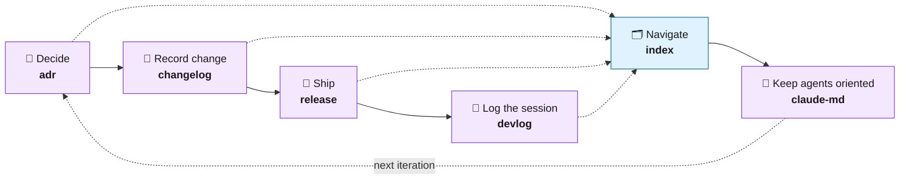
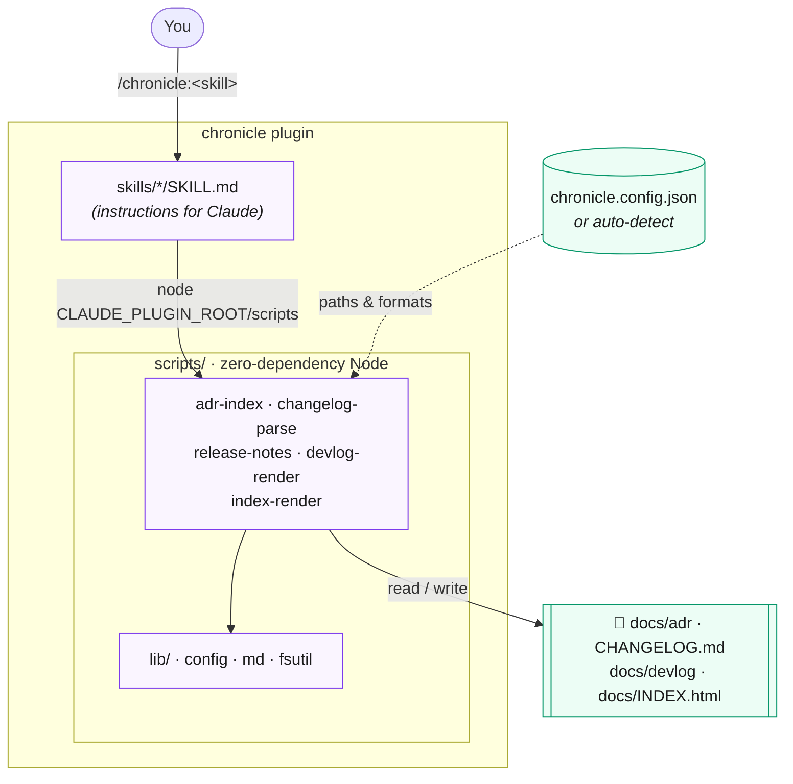

# 📜 chronicle

**English** · [한국어](README.ko.md)

> A Claude Code plugin that automates your project's **documentation lifecycle** — decisions, changes, releases, logs, and navigation — as six focused skills.

[](LICENSE)
[](https://code.claude.com/docs/en/plugins)
[](https://nodejs.org)
[](#how-its-built)

chronicle turns the documentation chores you keep forgetting — writing ADRs, updating the changelog, cutting releases, keeping a devlog, maintaining a project index and `CLAUDE.md` — into one-line workflows. Every workflow adapts to *your* project layout via a small optional config (with sensible auto-detection), and the deterministic parts run as zero-dependency Node scripts so they're fast and consistent.

---

## Why chronicle?

Good projects rot at the edges: decisions get made but never written down, the changelog drifts from reality, releases ship with hand-typed notes, and the `CLAUDE.md` that agents rely on goes stale. These chores are individually trivial and collectively never done. chronicle makes each one a single command — and because the heavy lifting runs in deterministic scripts (not the model), the output is consistent every time and costs almost no tokens.

## The documentation lifecycle

The six skills aren't isolated tools — they're stages of one loop. A decision becomes a changelog entry, which becomes release notes, which you record in a devlog, all surfaced through a single index, while `CLAUDE.md` keeps your agents oriented.



## Install

```text
/plugin marketplace add sp-daewoon/chronicle
/plugin install chronicle@chronicle
```

Requires Node.js 18+ on your PATH. That's the only dependency.

## Skills

| Skill | Slash command | What it does |
| --- | --- | --- |
| **adr** | `/chronicle:adr` | Create/transition Architecture Decision Records, auto-number, regenerate the index |
| **changelog** | `/chronicle:changelog` | Add Keep a Changelog entries; promote `[Unreleased]` into a version |
| **release** | `/chronicle:release` | Promote changelog, synthesize notes from CHANGELOG/ADRs/commits, tag, optionally publish via `gh` |
| **devlog** | `/chronicle:devlog` | Write a dated, self-contained HTML session log + index |
| **index** | `/chronicle:index` | Generate a single navigation hub linking ADRs, changelog, releases |
| **claude-md** | `/chronicle:claude-md` | Keep `CLAUDE.md` in sync with the codebase and lean |

## Usage

Record a decision:

```text
/chronicle:adr Use PostgreSQL for the primary datastore
```

Log a change:

```text
/chronicle:changelog Added dark mode toggle
```

Cut a release:

```text
/chronicle:release 1.2.0
```

Each skill also works conversationally — just describe what you want ("write up today's devlog", "regenerate the project index").

## How it works

Each skill is a thin set of instructions for Claude. When deterministic work is needed — parsing a changelog, numbering an ADR, rendering an index — the skill calls a small Node helper via `${CLAUDE_PLUGIN_ROOT}`. The helpers read your config (or auto-detect it), operate on your project files, and write the result back. The model decides *what* to do; the scripts handle *how*, identically every time.



> `claude-md` is the one skill with no helper — keeping `CLAUDE.md` lean is a judgment task, so it's fully model-driven.

## Configuration

chronicle works with **zero configuration** — it auto-detects common locations (`docs/adr`, `CHANGELOG.md`, `docs/devlog`). To customize, drop a `chronicle.config.json` in your project root:

```json
{
  "adr":       { "dir": "docs/adr", "numberWidth": 4, "indexFile": "docs/adr/README.md" },
  "changelog": { "path": "CHANGELOG.md", "format": "keepachangelog" },
  "devlog":    { "dir": "docs/devlog", "sections": ["Summary", "Changes", "Decisions", "Next"] },
  "index":     { "output": "docs/INDEX.html", "sources": ["adr", "changelog", "releases"] },
  "release":   { "provider": "github", "tagPrefix": "v", "readmeTable": true }
}
```

| Key | Field | Meaning |
| --- | --- | --- |
| `adr` | `dir` / `numberWidth` / `indexFile` | Where ADRs live, zero-pad width for numbers, the index file to regenerate |
| `changelog` | `path` / `format` | Changelog location and format (Keep a Changelog) |
| `devlog` | `dir` / `sections` | Where session logs go and which sections each log has |
| `index` | `output` / `sources` | Output file (`.md` or `.html` by extension) and what to include |
| `release` | `provider` / `tagPrefix` | Release provider (`github`) and tag prefix |

A starter template lives at `templates/chronicle.config.json`.

## How it's built

- **Skills** (`skills/*/SKILL.md`) are LLM instructions; deterministic work is delegated to **Node helpers** (`scripts/*.mjs`) called via `${CLAUDE_PLUGIN_ROOT}`.
- Helpers use only Node 18+ built-ins — **no npm dependencies**. The source comments are written in Korean for the maintainer; the code and all output are language-neutral.
- The repo is also its own marketplace (`.claude-plugin/marketplace.json`).

Run the helper tests:

```bash
npm test
```

## Discoverability (skillsmp.com)

[skillsmp.com](https://skillsmp.com) indexes public skills automatically by scraping GitHub — there's no submission form. A repo appears once it's public, uses the standard `SKILL.md` format (which chronicle does), and has **at least 2 stars**. If chronicle is useful to you, a ⭐ helps others find it.

## Contributing

Issues and PRs welcome. Each skill is independent; helpers are pure and unit-tested. Please run `npm test` and `claude plugin validate .` before opening a PR.

## License

[MIT](LICENSE) © sp-daewoon
